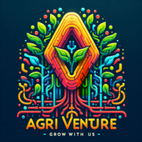
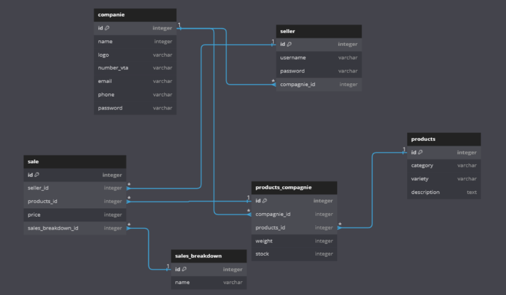

# Agriventure
Julie Montoux
## Sujet
### Contexte 
L’entreprise EARL Villemur tient une vente directe de fruits. Elle est gérée aujourd’hui par des tableaux journaliers sur feuille et le calcul se fait à la main. L’entreprise aimerait digitaliser la partie de gestion des ventes pour faciliter la lecture et l’archivage des rapports de ventes.
### Cahier des charges
Création d’une application android téléchargeable appelée Agriventure.
Elle permettrait de : 
Créer une commande avec ses produits, son prix, sa ventilation de paiement, le vendeur, le reçu par mail à l’acheteur
Création d’une fiche du détail de ventes à la journée avec le total des ventes, le détail de la ventilation de paiement
Une page administrateur pour gérer les stocks, la caisse (entrée et sortie) et les vendeurs, paramétrage d’une interface personnalisable (dans la mesure du possible)
Rapport de statistiques envoyées par mail à chaque fin de semaine automatiquement à l’entreprise
Page de connexion à l’ouverture de l’application
### Charte graphique
### Logo

### Typographie
Barlow
### Colorimétrie 
- Vert frais (pour évoquer la nature et les produits frais) : **#4CAF50**
- Orange chaleureux (pour symboliser la récolte et la convivialité) : **#FF9800**
- Brun terreux (pour rappeler la terre et la croissance) : **#795548**
- Bleu apaisant (pour la confiance et la simplicité) : **#2196F3**

## 2. Concevoir  et développer des composants d’interface utilisateur
- github : https://github.com/JulieMontoux/agriventure 
### Maquetter une application
Maquettage avec figma : https://www.figma.com/file/mdfXFG88TPPlde6sEcharQ/Agriventure?type=design&node-id=0%3A1&mode=design&t=YSNoo5u5meTV2ASu-1 

Idées : 
DASHBOARD ADMIN
Interface vendeur : 
https://www.figma.com/file/aokDqDeEIfyAZlx4z5BPNi/Food-POS-Dark---Tablet-Device-(Community)?type=design&node-id=0-1&mode=design&t=5SN8kyK6ia271tWo-0 
### Développer une interface utilisateur de type desktop
application web
### Développer des composants d’accès aux données
API + ORM
### Développer la partie front-end d’une interface utilisateur web
ReactJS ou Angular avec PrimeNG (lien entreprise)
### Développer la partie back-end d’une interface utilisateur web
Python
## Concevoir et développer la persistance des données
### Concevoir une base de données
lien dbdiagram : https://dbdiagram.io/d/65d65b63783e8c6ca51cd8e7 Version 1 - 21/02/2024

### Mettre en place une base de données
MySQL ou SQLite 
### Développer des composants dans le langage d’une base de données
Requêtes SQL
## Concevoir et développer une application multicouche
Collaborer à la gestion d’un projet informatique et à l’organisation de l’environnement de développement
miro ou monday
### Concevoir une application
dev
### Développer des composants métier
page admin avec dashboard
### Construire une application organisée en couches
### Développer une application mobile
.exe changement de langage ou intégrer l’app desktop à l’app mobile par une vue
### Préparer et exécuter les plans de tests d’une application
tests unitaires même si tester c’est douter
### Préparer et exécuter le déploiement d’une application 
Création d’une CI/CD
